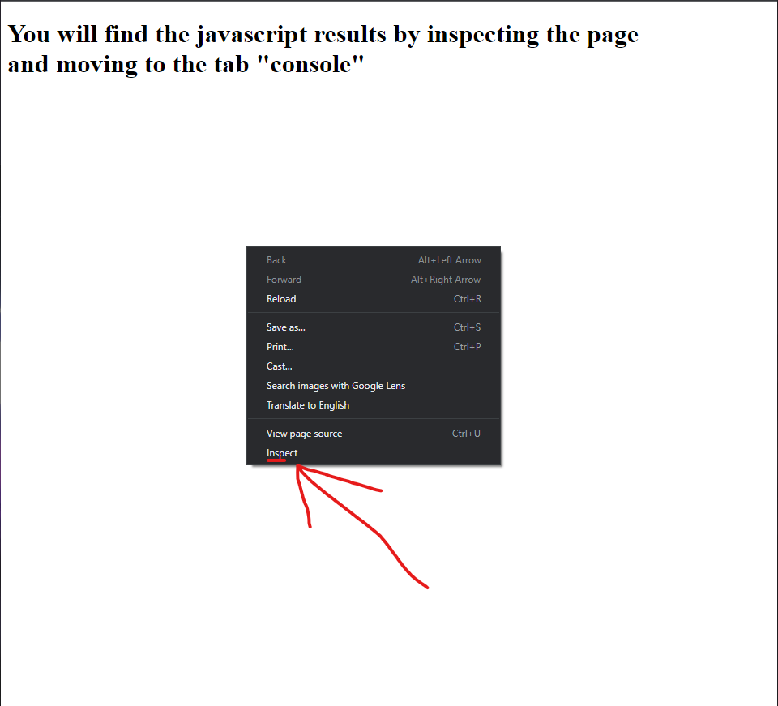
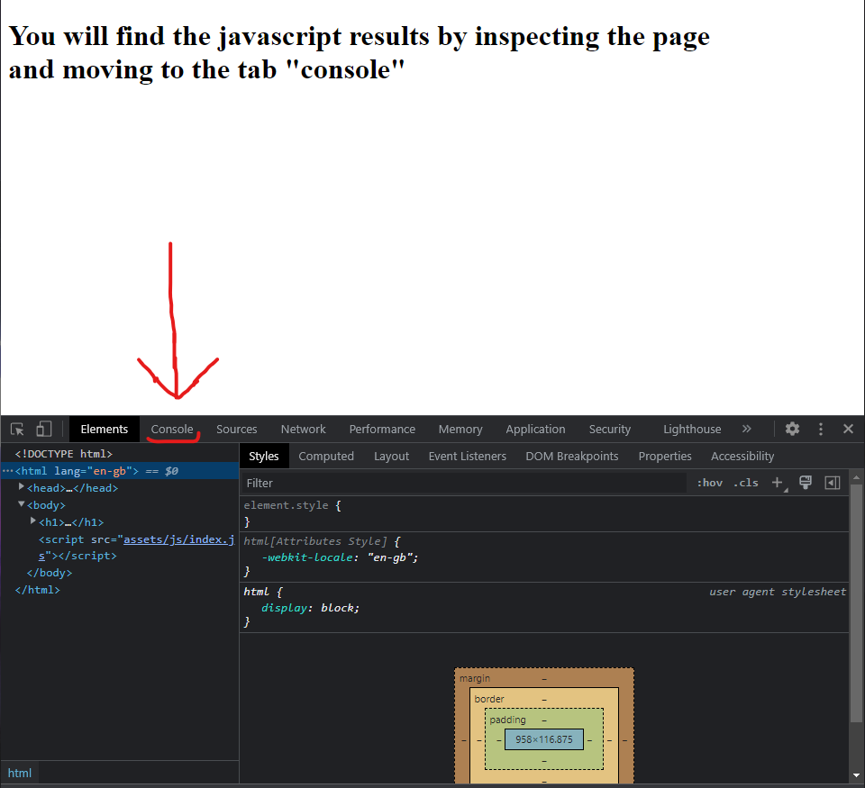
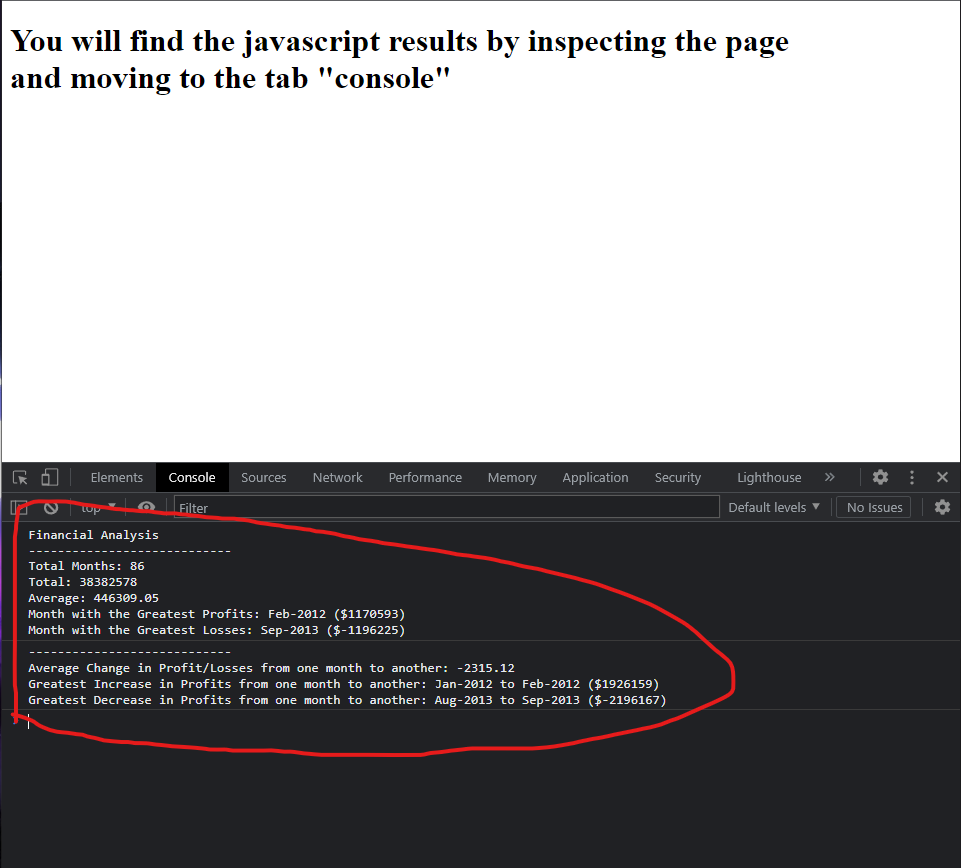

# Console-Finances
 
## Description
 
In this project we created a Financial analysis tool using javascript basic knowledge.
Provided a financial dataset we process and calculate the profit and losses to generate a log with important information for the company.
 
**Note:** This project I got to test my javascript skills and improve it, also with research, learning about a VScode built-in debugging tool for javascript which helps check the results step by step in real time.
 
## installation
 
N/A
 
## Usage
 
* For the purpose of testing/using this website you must use google chrome web browser and follow the steps below.
 
* Open the Console-finances web app, and right click in the center of the screen, a list of options will appear, choose inspect, image follows.

 
* change to the "console" tab, image follows.

 
* Now you have access to the Finances as the example in the following image.

 
## Credits
 
N/A
 
## Licence
 
Available under the MIT licence. See the LICENCE file for more info.
 
## Test

[Deployed application](https://guilhermederetti.github.io/Console-Finances/)
